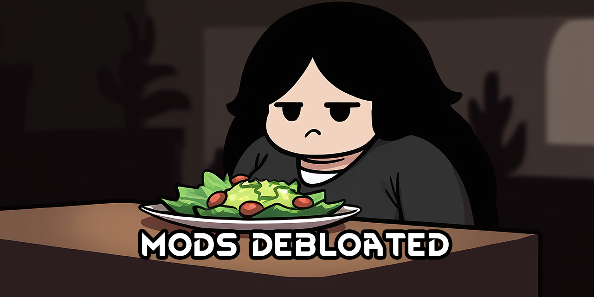

<!--[![GPLv3][badge-license]](https://www.gnu.org/licenses/gpl-3.0) -->
[badge-license]: https://img.shields.io/badge/License-GPLv3-lightgray
<!--![Supports Royalty][badge-dlc-royalty] supports Royalty DLC-->
[badge-dlc-royalty]: https://img.shields.io/badge/DLC-Royalty-gold
<!--![Supports Ideology][badge-dlc-ideology] supports Ideology DLC-->
[badge-dlc-ideology]: https://img.shields.io/badge/DLC-Ideology-indianred
<!--![Supports Biotech][badge-dlc-biotech] supports Biotech DLC-->
[badge-dlc-biotech]: https://img.shields.io/badge/DLC-Biotech-mediumturquoise
<!--![Supports Anomaly][badge-dlc-anomaly] supports Anomaly DLC-->
[badge-dlc-anomaly]: https://img.shields.io/badge/DLC-Anomaly-darkseagreen

# Reduce, Reuse, Recycle
\
[![GPLv3][badge-license]](https://www.gnu.org/licenses/gpl-3.0) ![Supports Royalty][badge-dlc-royalty] ![Supports Ideology][badge-dlc-ideology] ![Supports Biotech][badge-dlc-biotech]

Don't download this.

## Settings
All patches are toggable unless noted otherwise.

## Architect Tabs
- Butcher tables, kitchen sinks, stoves, etc into a new kitchen tab
- Hospital buildings and linkables into a new hospital tab
- (with Biotech) Mechanitor buildings from the Biotech tab into a new mechanitor tab
- (with Vehicle Framework) Modded buildings and vehicles from their own tabs into the existing vehicles tab

### [[BT] EyeGenes2 | Base - [NL] Facial Animation |](https://steamcommunity.com/sharedfiles/filedetails/?id=2898151329)
- Automatic, non-toggable patch to fix duplicate displayPriorityInXenotype red erros with other mods

### Adaptive Storage Framework
- Move more shelves to storage tab by patching ShelfBase

### [Adaptive Storage Neolithic Module](https://steamcommunity.com/sharedfiles/filedetails/?id=3033901895)
- Unlock all buildings with complex furniture

### [Combat Extended](https://steamcommunity.com/workshop/filedetails/?id=2890901044)
- Remove duplicate gas mask
- Remove apparel tags from powered exoframe to make it player-only

### [Combat Extended Armory](https://steamcommunity.com/sharedfiles/filedetails/?id=2911110083)
- Remove composite armor and helmet

### [Custom Colt Anaconda](https://steamcommunity.com/sharedfiles/filedetails/?id=2437436419)
- Prevent the .50 BMG variant from spawning on non-spacer pawns because it can easily shoot off entire limbs

### [Dubs Bad Hygiene](https://steamcommunity.com/sharedfiles/filedetails/?id=836308268)
- Prevent traits from being generated on new pawns

### [GiTS Cyberbrains](https://steamcommunity.com/sharedfiles/filedetails/?id=3272114598)
- Remove abilities to make the brains less OP and reduce gizmo clutter

### [Mario's Pizza](https://steamcommunity.com/sharedfiles/filedetails/?id=3226188356)
- Remove chef's hat and mustache

### Mashed's Ashlands
- Create a dropdown for wood floors and bridges in the architect menu so parasol floors don't take up more space

### [Medical Training](https://steamcommunity.com/sharedfiles/filedetails/?id=1214615921)
- Remove (tm) from table name
- Remove wood from costlist
- Upscaled table texture

### Rebuild: Doors and Corners + Dubs Skylights
- Use ReBuild glass for Dubs Skylights

### [ReGrowth: Core](https://steamcommunity.com/workshop/filedetails/?id=2260097569)
- Remove grassland biome

### [RimJobWorld](https://gitgud.io/Ed86/rjw)
- Remove cum eating fetish shit and humpshroom psyfocus gain

#### + [Adaptive Storage Framework](https://steamcommunity.com/workshop/filedetails/?id=3033901359)
- Unused condoms can be stored in end tables

### The Dead Man's Switch
- Remove all empire overlap
- Make faction natural enemy
- Lower settlement commonality to vanilla faction values
- Remove vanilla tags from apparel and weapons

### Vanilla Expanded Framework
- Change worktype for unloading item processor from Hauling to the higher priority BasicWorker

### Vanilla Furniture Expanded
- Modify research tree so waste disposal is more accessible

## Legal
Portions of the materials used to create this mod are trademarks and/or copyrighted works of Ludeon Studios Inc. All rights reserved by Ludeon. This mod is not official and is not endorsed by Ludeon.